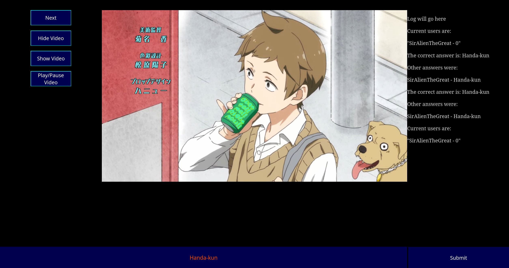

<h1>oped-game-v2</h1>
<subtitle>A very WIP self-hosted animemusizquiz clone</subtitle>

<h1>Installation</h1>
<h2>Client</h2>
<ol>
  <li>Download the client from the releases page</li>
  <li>Install a webserver that supports webassembly. I use <a href="https://httpd.apache.org/">apache</a>.</li>
  <li>Unzip all files from the release file into your public directory. On linux this is usually /var/www/html or /srv/http.</li>
  <li>Start your webserver and open <a href="http://127.0.0.1/index.html">127.0.0.1/index.html</a>. Other users will use your IP address.</li>
  <li>Enter the IP address of the server and start playing</li>
</ol>

<h2>Server</h2>
<ol>
  <li>Make sure port 9002 is unblocked in your firewall</li>
  <li>Download the release file for your platform from the releases page</li>
  <li>Run the file you just downloaded. On Linux, you may need to <code>chmod +x</code> your file</li>
</ol>

<h1>Building from source</h1>
<h2>Client</h2>
<ol>
  <li>Install Rust following <a href="https://www.rust-lang.org/learn/get-started">this guide</a></li>
  <li>Install wasm-pack using cargo install wasm-pack</li>
  <li>Clone this repo with <code>git clone https://github.com/SirAlienTheGreat/oped-game-v2</code></li>
  <li><code>cd oped-game-v2/Client</code></li>
  <li><code>wasm-pack build --target web</code></li>
  <li>The files you need to install using the method above are: answer-only.html, index.html, and the pkg directory</li>
</ol>

<h2>Server</h2>
<ol>
  <li>Install Rust following <a href="https://www.rust-lang.org/learn/get-started">this guide</a></li>
  <li>Clone this repo with <code>git clone https://github.com/SirAlienTheGreat/oped-game-v2</code></li>
  <li><code>cd oped-game-v2/server</code></li>
  <li><code>cargo build --release</code></li>
  <li>Your files will be in <code>target/release</code></li>
</ol>
